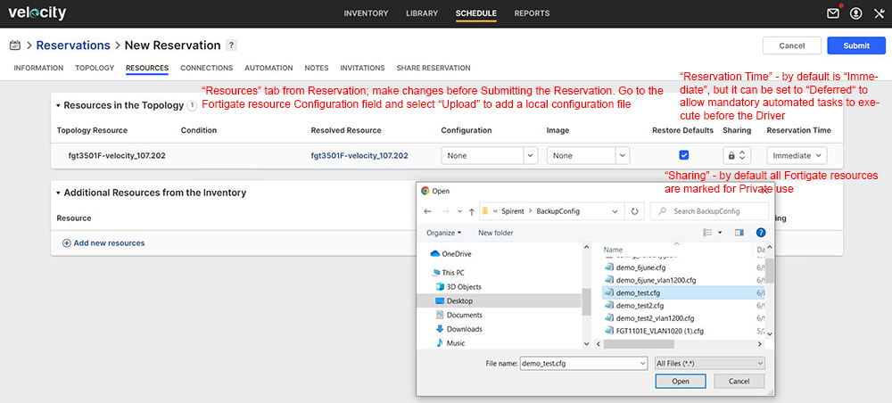
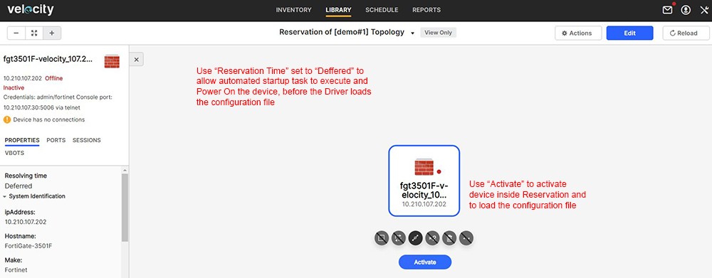
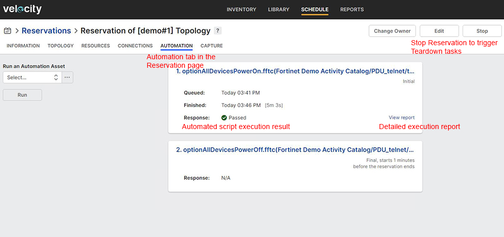

# User Steps:

* **Create a new Topology with a single Fortigate resource added from Velocity Inventory**
    * Goto Library/Topologies page from Velocity top menu and click on "Add" to create a new Topology; select any available Fortigate firewall; make sure to fill in Name, Description and Tags fields for advanced Topology filtering; "Save" Topology 
    * L1 and L2 Inventory Resources are not available to choose from when creating a new Toplogy as they are used dynamically by Velocity when building L1 or L2 connections between Resources
    * Below you can find a sample Topology "\[demo#1\] Topology" that can be used for training purposes; open Topology link in a new tab and click "Edit" if you want to make changes; "Save" Topology after editing 

* **Reserve Topology**  
    * Default Reservation duration is 60 minutes
    * In this activity page click on "Reserve" topology to create a new Reservation; you should see "Release" button to end the Reservation

* **On Reservation Page:**
    * Open Reservation link in a new tab and wait for Reservation to become "Active"; on "Information" tab you should see the Reservation status as "Active" if Reservation is successful
    * Goto Topology tab and click on the Fortigate resource; the Topology page should open
    * Click on Fortigate resource and select "Actions" -> "HTTP"; a new HTTP connection to Fortigate should open in a new window
    * Click on Fortigate resource and select "Sessions" tab located in the left side of the page; inherited sessions tab should display the "console" session; run "console" session to open a new Console connection to Fortigate (console connection type is telnet)
    * Inside the console connection you should see "QuickCalls" menu in the top-left corner of the page; a list of console quickcalls (custom user actions) are implemented and available for use
    * Select "consoleLogin" and "Run Quickcall"; you should automatically connect to Resource via the console connection
    * Now, you can eiter use the console to enter any commands or use some of the avilable quickcalls to perform specific actions (some of the quickcalls require user input parameters; more quickcalls will be detailed in next demos)
    * For example select "getPortSpeed" quickcall and enter port name parameter (e.g. port31) to display port name speed settings inside the console window (please see snapshot#1 under Images section below)
    * Click on Fortigate resource and select "VBOTS" tab located in the top-left corner of the page; "Power On", "Power Off" and "Power Cycle" user actions list should be available for use (please note that Power On/Off actions are implemented for Fortigate resources only; implementation is based on specific tag "optionPDU" assigned to "Fortigate Firewall" template)
    * For example run vBOT "Power Cycle" and check "Results" tab for the execution report; Click on "View report" to open the "Execution Report" page in a new window (you can check script result and execution messages for detailed information)
    *  You may also try to save the Fortigate configuration by selecting "backupConfigTFTP" quickcall from the console; for this Quickcall the user needs to enter "config_name" and "tftp" parameters values
    * Goto TFTP server (currently VDS is configured as TFTP server and can be accessed at here: [tftp](https://10.210.107.20/tftp); Download and validate Fortigate configuration
    * To load a saved configuration you may use "restoreConfigTFTP" quickcall or the Fortigate Driver script before starting a new Reservation; "Fortigate Driver" is a script which can perform On Demand (when clicking "Discover" button under Inventory) to collect Resource properties and port information or while Reservation is Activating to load a configuration file
    * To use Fortigate Driver for uploading a local configuration file you'll need to "Release" the current Reservation from this activity page; Open Topology from this activity page in a new tab and click on "Reserve"; a new Reservation page opens with more user options before "Submit"; Goto "Resources" tab and select "Upload" for the Configuration field from the Fortigate resource (please see snapshot#2 under Images section below)
    * Fortigate Driver gets executed prior to any Mandatory tasks which means that Fortigate firewall resource needs to be already Powered On when the driver loads the configuration file and Reservation gets Activated; One methos is to use "Reservation Time" set to "Deferred" to allow Power On Startup task to execute; After the Fortigate is powered on you may "Activate" the Fortigate inside Topology page (please see snapshot#3 under Images section below)
    * Goto "Automation" tab and check madatory tasks execution report (please see snapshot#4 under Images section below) 

* **Mandatory Automation Tasks:**
    * Goto "Topologies" section below this activity page and open Startup and Teardown tasks; these are mandatory tasks created by the Admin and configured to be executed at the start and end of each Reservation; execution reports are displayed in real time if you click on "View report" link
    * Startup mandatory task "optionAllDevicesPowerOn.fftc - will "Power On" all Fortigate firewall devices as soon as you hit "Reserve" on the Topology
    * Teardown mandatory task "optionAllDevicesPowerOff.fftc" - will "Power Off" all Fortigate firewall devices from Topology; if not used in an Active Reservation all Fortigate devices should be powered off

# Images:

