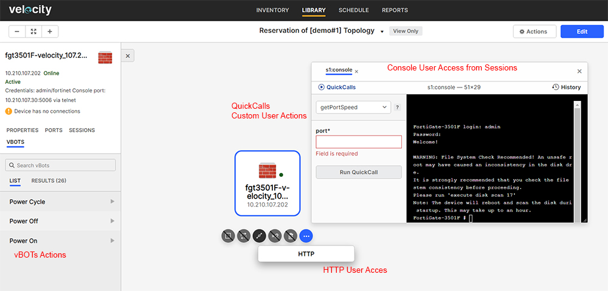

# User Steps:

* **Create a new Topology with a single Fortigate resource added from Velocity Inventory**
    * L1 and L2 Inventory Resources are not available to choose when creating a new Toplogy as they are used dynamically by Velocity when building L1 or L2 connections between Resources
    * Make sure to fill in Name, Description and Tags fields for advanced filtering
    * Below you can find a sample Topology that can be used for training purposes (click on "Reserve" button for \[demo#1\] Topology)
* **Reserve Topology**  
    * Default Reservation duration is 60 minutes
    * If Reservation is successful you should see "Release" button to end Reservation
    * Click on "Reservation of \[demo#1\] Topology" to enter Velocity Reservations page
* **On Reservation Page:**
    * On Information tab you should see the Reservation status as Active
    * Goto Topology tab and click on the Fortigate resource; the Topology page should open
    * Click on Fortigate resource and select "Actions" -> "HTTP"; a new HTTP connection to Resource should open in a new window
    * Click on Fortigate resource and select "Sessions" tab located in the left side of the page; Inherited sessions tab should display the "console" session
    * Run "console" session to open a new Console connection to Fortigate
    * Inside the console connection you should see "QuickCalls" menu in the top-left corner of the page; a list of console quickcalls (custom user actions) are implemented and available for use
    * Select "consoleLogin" and "Run Quickcall"; you should automatically connect to Resource via the console connection
    * Now, you can eiter use the console to enter any commands or use some of the avilable quickcalls to perform specific actions (some of the quickcalls require user input parameters) 
    * For example select "getPortSpeed" quickcall and enter port name parameter (e.g. port31) to display port name speed settings inside the console window
    * Click on Fortigate resource and select "VBOTS" tab located in the top-left corner of the page; "Power On", "Power Off" and "Power Cycle" user actions list should be available for use (please note that Power On/Off actions are implemented for Fortigate resources only; implementation is based on specific tag "optionPDU" assigned to "Fortigate Firewall" template)
    * For example run vBOT "Power Cycle" and check "Results" tab for the execution report; Click on "View report" to open the "Execution Report" page in a new window (you can check script result and execution messages for detailed information)

# Images:

