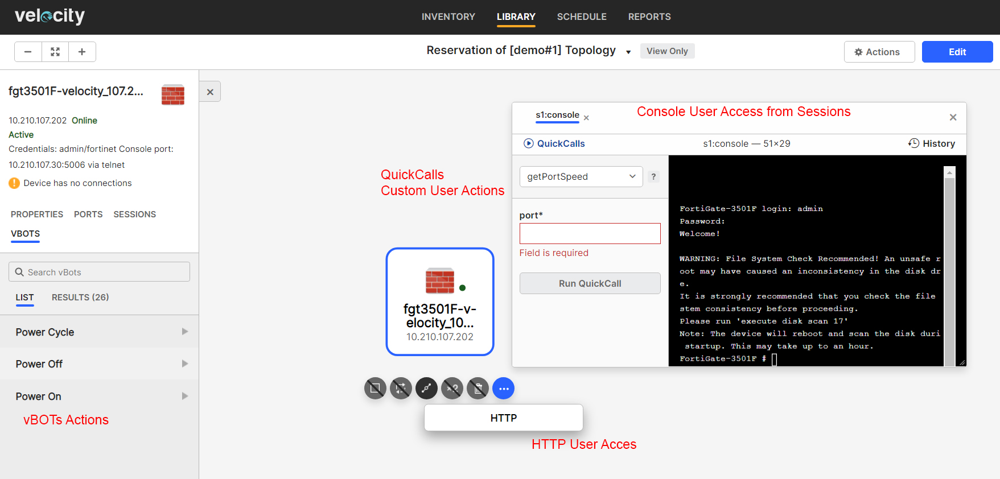

# User Steps:

* **Create a new Topology with a single Fortigate resource connected to a Test switch using "New VLAN" from "Topology" page**
    * L1 and L2 Inventory Resources are not available to choose when creating a new Toplogy as they are used dynamically by Velocity when building L1 or L2 connections between Resources
    * Make sure to fill in Name, Description and Tags fields for advanced filtering
    * Below you can find a sample Topology that can be used for training purposes (click on "Reserve" button for \[demo#1\] Topology)
* **Reserve Topology**  
    * Default Reservation duration is 60 minutes
    * If Reservation is successful you should see "Release" button to end Reservation
    * Click on "Reservation of \[demo#1\] Topology" to enter Velocity Reservations page
* **On Reservation Page:**
    * On Information tab you should see the Reservation status as Active
    * Goto Topology tab and click on the Fortigate resource; the Topology page should open
    * Click on Fortigate resource and select "Actions" -> "HTTP"; a new HTTP connection to Fortigate should open in a new window
    * Click on Fortigate resource and select "Sessions" tab located in the left side of the page; Inherited sessions tab should display the "console" session
    * Run "console" session to open a new Console connection to Fortigate
    * Inside the console connection you should see "QuickCalls" menu in the top-left corner of the page; a list of console quickcalls (custom user actions) are implemented and available for use
    * Select "consoleLogin" and "Run Quickcall"; you should automatically connect to Resource via the console connection
    * Now, you can eiter use the console to enter any commands or use some of the avilable quickcalls to perform specific actions (some of the quickcalls require user input parameters) 
    * For example select "getPortSpeed" quickcall and enter port name parameter (e.g. port31) to display port name speed settings inside the console window
    * Click on Fortigate resource and select "VBOTS" tab located in the top-left corner of the page; "Power On", "Power Off" and "Power Cycle" user actions list should be available for use (please note that Power On/Off actions are implemented for Fortigate resources only; implementation is based on specific tag "optionPDU" assigned to "Fortigate Firewall" template)
    * For example run vBOT "Power Cycle" and check "Results" tab for the execution report; Click on "View report" to open the "Execution Report" page in a new window (you can check script result and execution messages for detailed information)
* **Mandatory Automation Tasks:**
    * Goto "Topologies" section below this activity page and open Startup and Teardown tasks; these are mandatory tasks created by the Admin and configured to execute at the start and end of each Reservation
    * As soon as you hit "Reserve" on this Topology the mandatory Startup task to "Power On" executes for the Fortigate; Click on "Reservation of \[demo#1\] Topology" and in the Reservation page navigate to "Automation" tab; The script "optionAllDevicesPowerOn.fftc" (configured as mandatory Startup task) execution report can be displayed in real time if you click on "View report"
    * After Reservation is in Active state and Startup task execution is "Passed" you can stop the Reservation from the Reservation page and select "Run Tasks and Stop" option to trigger "Power Off" Teardown task execution; "Automation" tab displays script "optionAllDevicesPowerOff.fftc" (configured as mandatory Teardown task) execution report
    * All Fortigate devices should be Powered Off if they are not used in an active Reservation; these mandatory automated tasks to Power On/Off apply to "Fortigate Firewall" devices only (test switches which are shared among users will not be Powered Off by these automated tasks) 

# Images:
#

