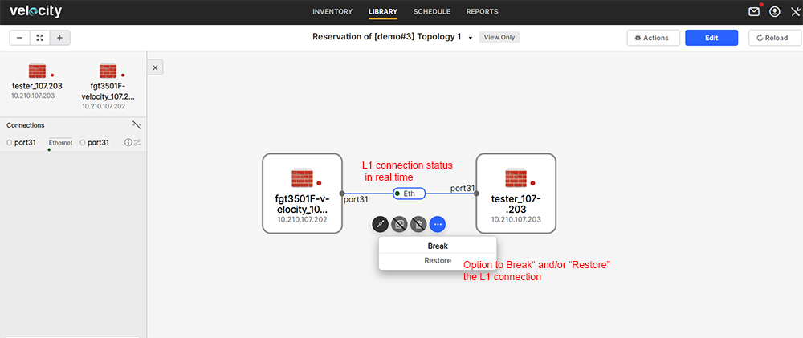

# User Steps:

* **Create a new Topology with a Fortigate resource connected to a Tester or other Resource (except L2 switch) using L1 connections in between**
    * When connecting the Fortigate to another Resource and there is a L1 connection in between, you will not see the L1 ports in Velocity; Velocity knows how to map the L1 ports to establish the requested connection between Resources; Options to "Break" and/or "Restore" the L1 connection will be available in the Topology page after the Reservation becomes Active
    * Once the Reservation becomes Active you will see the L1 resolved ports under "Resources" tab in the Reservation page
    * Below in this activity page you can find a sample Topology (\[demo#3\] Topology 1) that can be used for training purposes
    * Click (open in a new window) on "\[demo#3\] Topology 1" below in this activity page and go to the "Topology" page; you will see the Fortigate connected to a Tester device; the L1 connection between these 2 Resources is not visible in the Topology page, but should be already created in the "Physical Connections" page under Inventory
    * From this activity page click on "Reserve" to start the Reservation; click (open in a new tab) on "Reservation of \[demo#3\] Topology 1" and go to the "Reservation" page
* **Create a new Topology with a Fortigate resource connected to a Test switch using L1 connections in between**
    * When connecting the Fortigate to a L2 switch and there is a L1 connection in between, you will not see neither L1 and L2 connections in Velocity; Velocity knows how to map the L1 ports to establish the requested connection to a L2 switch; the Driver dynamically build the requested VLAN on top of the L1 connection; Options to "Break" and/or "Restore" the L1 connections are not available if there is an L2 connections on top 
    * Below in this activity page you can find a sample Topology (\[demo#3\] Topology 2) that can be used for training purposes
    * Click (open in a new window) on "\[demo#3\] Topology 2" below in this activity page and go to the "Topology" page; you will see the Fortigate connected to a VLAN cloud; the L1 connection is not visible in the Topology page, but should be already created in the "Physical Connections" page under Inventory
    * From this activity page click on "Reserve" to start the Reservation; click (open in a new tab) on "Reservation of \[demo#3\] Topology 2" and go to the "Reservation" page
* **Reserve Topology**  
    * Default Reservation duration is set to 30 minutes
    * If Reservation is successful you should see "Release" button to end Reservation; goto "Reservation" page
* **On Reservation Page:**
    * On "Information" tab you should see the Reservation status as Active
    * Goto "Resources" tab from the Reservation page and check "Resources Added when the Topology was Resolved" tab; you should see the L1 ports that have been dynamically added by Velocity; also here you should see you should see Ports information from the Test switch and VLAN information per Port (if any)
    * For "Reservation of \[demo#3\] Topology 1" goto "Topology" page and click on the Link between the two Resources - you should see the option to "Break" and then "Restore" the link; Velocity displays in real time the status of the L1 connection (please see snapshot below under Images section)
    * For "Reservation of \[demo#3\] Topology 2" goto "Topology" page; you will see VLAN information as L2 connectivity is on top of the L1; L1 connectivity information is located under "Resources" page 
    * Goto "Automation" tab to see the configured mandatory automated tasks
* **Mandatory Automation Tasks:**
    * Goto "Topologies" section below this activity page and open Startup and Teardown tasks; these are mandatory tasks created by the Admin and configured to execute at the start and end of each Reservation
    * As soon as you hit "Reserve" on this Topology the mandatory Startup task to "Power On" executes for the Fortigate; Click on "Reservation of \[demo#3\] Topology" and in the Reservation page navigate to "Automation" tab; The script "optionAllDevicesPowerOn.fftc" (configured as mandatory Startup task) execution report can be displayed in real time if you click on "View report"
    * After Reservation is in Active state and Startup task execution is "Passed" you can stop the Reservation from the Reservation page and select "Run Tasks and Stop" option to trigger the "Driver" script (for cleanup the VLAN configuration), and the "Backup" and "Power Off" Teardown tasks execution; "Automation" tab displays scripts execution reports in real time
    * The "Backup" script "optionBackupVelocityReservationDetails.fftc" configured as mandatory Teardown task is creating a backup archive which is sent to the "Reservation"'s owner (User) email address; the email displays all "Reservation" detailed information about Topology, Resources, Ports and VLANs taken from Velocity as HTML format and also contains the configuration files from all "Fortigate firewall" and "Test switch" devices from Topology and the Topology file as TBML (The TBML file can be imported manually in Velocity); L1 ports information is part of the backup email report  
    * Expect new email from "velocity@fortinet.com" and check L1 device and port information
    * All Fortigate devices should be Powered Off if they are not used in an active Reservation; these mandatory automated tasks to Power On/Off apply to "Fortigate Firewall" devices only (test switches which are shared among users will not be Powered Off by these automated tasks) 

# Images:
#

