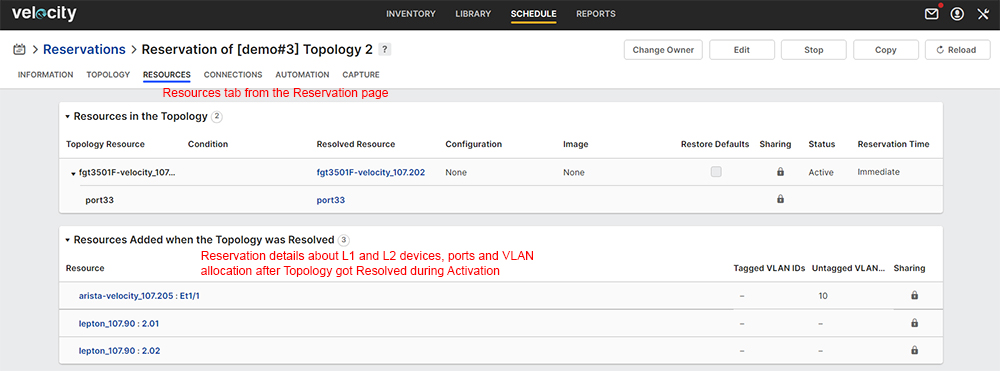

# User Steps:

* **Create a new Topology with a Fortigate resource connected to a (non) L2 switch using L1 connections in between**
    * When connecting the Fortigate to another Resource (non L2 switch) and there is a L1 connection in between, you will not see the L1 ports in Velocity; Velocity knows how to map the L1 ports to establish the requested connection between Resources; Options to "Break" and/or "Restore" the L1 connection will be available in the Topology page after the Reservation becomes "Active"
    * When connecting the Fortigate to a L2 switch and there is a L1 connection in between, you will not see neither L1 and L2 connections in Velocity; Velocity knows how to map the L1 ports to establish the requested connection to a L2 switch; the Driver dynamically build the requested VLAN on top of the L1 connection; Options to "Break" and/or "Restore" the L1 connections are NOT available if there is a L2 connection on top
    * For training purposes there are 2 Topologies available in this activity page; "\[demo#3\] Topology 1" - for L1 connection only and "\[demo#3\] Topology 2" - for L1 connection under L2 connection
    * Open Topology link in a new tab and click "Edit"; click on "VLAN" cloud (if any) and check "ID" field in the left side of the page; you can define a custom VLAN ID or you can let Velocity choose a VLAN ID for you
    * "Save" Topology after editing

* **Reserve Topology**  
    * Default Reservation duration is set to 30 minutes
    * In this activity page click on "Reserve" topology to create a new Reservation; you should see "Release" button to end the Reservation

* **On Reservation Page:**
    * Open Reservation link in a new tab and wait for Reservation to become "Active"; on "Information" tab you should see the Reservation status as "Active" if Reservation is successful
    * Goto "Topology" tab and select the Link - you should see the option to "Break" and "Restore" the link; Velocity displays in real time the status of the L1 connection (please see snapshot below under Images section); if L2 connectivity is built on top of L1 you will not have these actions available
    * Goto "Resources" tab and check what Resources were added after the Topology got resolved; you should see the L1 devices and ports that have been dynamically added by Velocity; you should also see Ports and VLAN information (if any) per Port (please see snapshot below under Images section)
    * Goto "Automation" tab and check madatory tasks execution reports

* **Mandatory Automation Tasks:**
    * Goto "Topologies" section below this activity page and open Startup and Teardown tasks; these are mandatory tasks created by the Admin and configured to be executed at the start and end of each Reservation; execution reports are displayed in real time if you click on "View report" link
    * Startup mandatory task "optionAllDevicesPowerOn.fftc - will "Power On" all Fortigate firewall devices as soon as you hit "Reserve" on the Topology
    * Teardown mandatory task "optionBackupVelocityReservationDetails.fftc" - is used to build a backup archive which is sent to the "Reservation"'s owner (User) email address; the email displays "Reservation" detailed information about Topology, Resources, Ports (including L1 connectivity details) and VLANs (if any) information taken from Velocity as HTML format; it also contains the configuration files from the Devices involved in the Topology and the Topology file as TBML (the TBML file can be imported manually in Velocity)  
    * Teardown mandatory task "optionAllDevicesPowerOff.fftc" - will "Power Off" all Fortigate firewall devices from Topology; if not used in an Active Reservation all Fortigate devices should be powered off

# Images:

