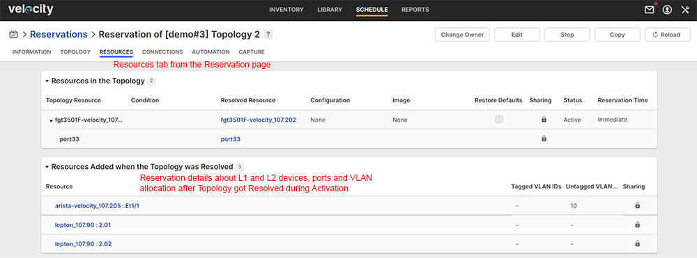

# User Steps:

* **Create a new Topology with a Fortigate resource connected to L2 management switch**
    * When connecting the Fortigate to a L2 switch for Management just select "New VLAN" from the right side panel within the "Topology" page; Velocity will know how to connect the Fortigate to a L2 management switch based on the existing "Physical Connections" under the Inventory (otherwise you'll get a "Connection" error) 
    * Below in this activity page you can find a sample Topology (\[demo#4\] Topology 1) that can be used for training purposes
    * Click (open in a new window) on "\[demo#4\] Topology 1" below in this activity page and go to the "Topology" page; click "Edit" to open the Topology for editing; click on "VLAN" cloud and check "ID" field in the left side of the page; you can define a custom VLAN ID or you can let Velocity choose a VLAN ID which is not used; Velocity is selecting the VLAN ID value from the "VLAN ID Set" which is defined for all Management L2 switch resources independently (current set is \[1200-1209\] for all management switches). Change VLAN ID value and save Topology
    * From this activity page click on "Reserve" to start the Reservation; click on "Reservation of \[demo#4\] Topology 1" and go to the "Reservation" page
    * The Management switch "Driver" script is triggered to build the VLAN expected configuration and resolve the Reservation
    * For a single VLAN, Velocity is using tagging "untagged" to identify the request; this translates in sending specific commands through the console connection to create a trunk native VLAN (Fortinet Management switch) using the VLAN ID from Topology
* **Reserve Topology**  
    * Default Reservation duration is set to 30 minutes
    * If Reservation is successful you should see "Release" button to end Reservation; goto "Reservation" page
* **On Reservation Page:**
    * On "Information" tab you should see the Reservation status as Active
    * Goto "Resources" tab from the Reservation page and check "Resources Added when the Topology was Resolved" tab; you should see the L1 ports that have been dynamically added by Velocity; also here you should see you should see Ports information from the Test switch and VLAN information per Port (if any)
    * For "Reservation of \[demo#3\] Topology 1" goto "Topology" page and click on the Link between the two Resources - you should see the option to "Break" and then "Restore" the link; Velocity displays in real time the status of the L1 connection (please see snapshot below under Images section)
    * For "Reservation of \[demo#3\] Topology 2" goto "Topology" page; you will see VLAN information as L2 connectivity is on top of the L1; L1 connectivity information is located under "Resources" page (please see snapshot below under Images section)
    * Goto "Automation" tab to see the configured mandatory automated tasks
* **Mandatory Automation Tasks:**
    * Goto "Topologies" section below this activity page and open Startup and Teardown tasks; these are mandatory tasks created by the Admin and configured to execute at the start and end of each Reservation
    * As soon as you hit "Reserve" on this Topology the mandatory Startup task to "Power On" executes for the Fortigate; Click on "Reservation of \[demo#3\] Topology" and in the Reservation page navigate to "Automation" tab; The script "optionAllDevicesPowerOn.fftc" (configured as mandatory Startup task) execution report can be displayed in real time if you click on "View report"
    * After Reservation is in Active state and Startup task execution is "Passed" you can stop the Reservation from the Reservation page and select "Run Tasks and Stop" option to trigger the "Driver" script (for cleanup the VLAN configuration), and the "Backup" and "Power Off" Teardown tasks execution; "Automation" tab displays scripts execution reports in real time
    * The "Backup" script "optionBackupVelocityReservationDetails.fftc" configured as mandatory Teardown task is creating a backup archive which is sent to the "Reservation"'s owner (User) email address; the email displays all "Reservation" detailed information about Topology, Resources, Ports and VLANs taken from Velocity as HTML format and also contains the configuration files from all "Fortigate firewall" and "Test switch" devices from Topology and the Topology file as TBML (The TBML file can be imported manually in Velocity); L1 ports information is part of the backup email report  
    * Expect new email from "velocity@fortinet.com" and check L1 device and port information
    * All Fortigate devices should be Powered Off if they are not used in an active Reservation; these mandatory automated tasks to Power On/Off apply to "Fortigate Firewall" devices only (test switches which are shared among users will not be Powered Off by these automated tasks) 

# Images:
#
#

