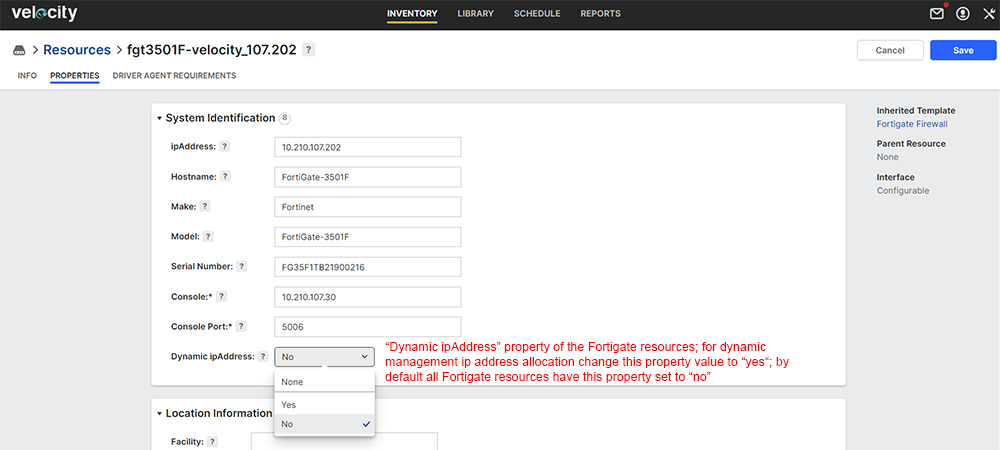
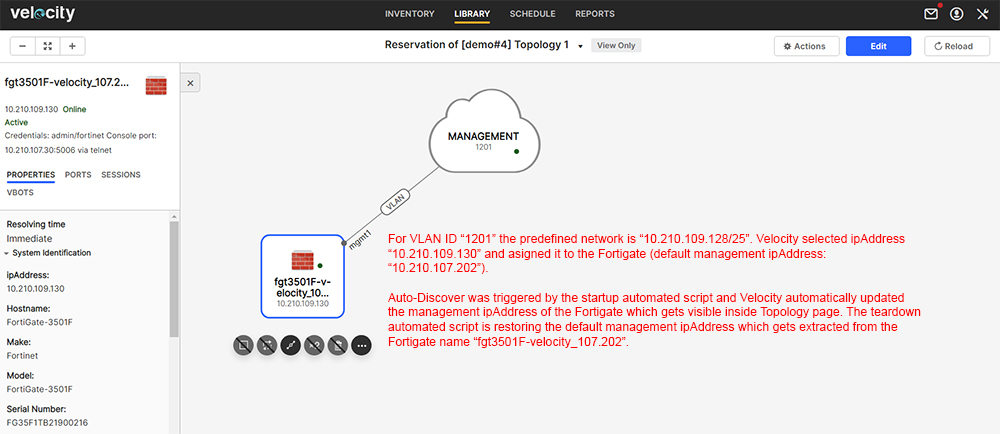

# User Steps:

* **Create a new Topology with a Fortigate resource connected to L2 Management switch**
    * When connecting the Fortigate to a L2 switch just select "New VLAN" from the right side panel within the "Topology" page; Velocity will know how to connect the Fortigate to a L2 switch based on the existing "Physical Connections" under the "Inventory" (otherwise you'll get a "Connection" error)
    * To change Management VLAN configuration you'll need to change VLAN ID to a specified value used for Management; if you change the Management VLAN you may want to assign a new Management "ipAddress" to the Fortigate firewall resource; for this purpose there is a mandatory startup task which dynamically assigns a new "ipAddress" for the Fortigate based on range of ip addresses predefined for the Management Networks (current VLAN ID Set for Management is: "1200 - 1209") 
    * Below in this activity page you can find a sample Topology "\[demo#4\] Topology 1" that can be used for training purposes
    * Open Topology link in a new tab and click "Edit"; click on "VLAN" cloud and check "ID" field in the left side of the page; you can define a custom Management VLAN ID (predefined) or you can let Velocity choose a VLAN ID for you; the default management VLAN ID is "1020" and will be re-configured automatically by the Driver on the Management switch when Reservation ends and VLAN configuration gets removed
    * "Save" Topology after editing

* **Reserve Topology**  
    * Default Reservation duration is set to 30 minutes
    * In this activity page click on "Reserve" topology to create a new Reservation; you should see "Release" button to end the Reservation

* **On Reservation Page:**
    * Open Reservation link in a new tab and wait for Reservation to become "Active"; on "Information" tab you should see the Reservation status as "Active" if Reservation is successful
    * Goto "Topology" tab and check Driver execution for VLAN configuration
    * Goto "Resources" tab and check what Resources were added after the Topology got resolved; you should see Ports and VLAN information per Port 
    * Goto "Automation" tab and check madatory tasks execution reports

* **Mandatory Automation Tasks:**
    * Goto "Topologies" section below this activity page and open Startup and Teardown tasks; these are mandatory tasks created by the Admin and configured to be executed at the start and end of each Reservation; execution reports are displayed in real time if you click on "View report" link
    * Startup mandatory task "optionAllDevicesPowerOn.fftc - will "Power On" all Fortigate firewall devices as soon as you hit "Reserve" on the Topology
    * Startup mandatory task "optionSetMgmtIpAddr.fftc" - will be executed ONLY IF property "Dynamic ipAddress" of the Fortigate is set to "Yes" (by default "Dynamic ipAddress" resource property is set to "No"); Only Fortigate firewall devices have this property available and you'll need to "Edit" the Fortigate resource (request Admin to Edit the Resource) before you start the Reservation and task execution begins (please see snapshot under Images section below); Auto-Discover will dynamically update the new "ipAddress" property of the Fortigate which is reflected in the Topology tab (please see snapshot under Images section below) 
    * Teardown mandatory task "optionBackupVelocityReservationDetails.fftc" - is used to build a backup archive which is sent to the "Reservation"'s owner (User) email address; the email displays "Reservation" detailed information about Topology, Resources (check new ipAddress field), Ports and VLANs information taken from Velocity as HTML format; it also contains the configuration files from the Devices involved in the Topology and the Topology file as TBML (the TBML file can be imported manually in Velocity)
    * Teardown mandatory task "optionRestoreDefaultMgmtIpAddr.fftc" - will bring back the default Management configuration on the Fortigate based on the resource unique "Name" property (e.g. "fgt3501F-velocity_107.202" - naming convention for all Fortigate firewall resources names); Auto-Discover is triggered automatically to update the default "ipAddress" and default VLAN configuration on the L2 Management switch (default Management VLAN ID is: "1020")
    * Teardown mandatory task "optionAllDevicesPowerOff.fftc" - will "Power Off" all Fortigate firewall devices from Topology; if not used in an Active Reservation all Fortigate devices should be powered off

# Images:

