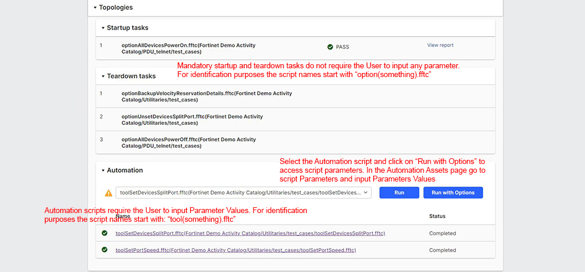
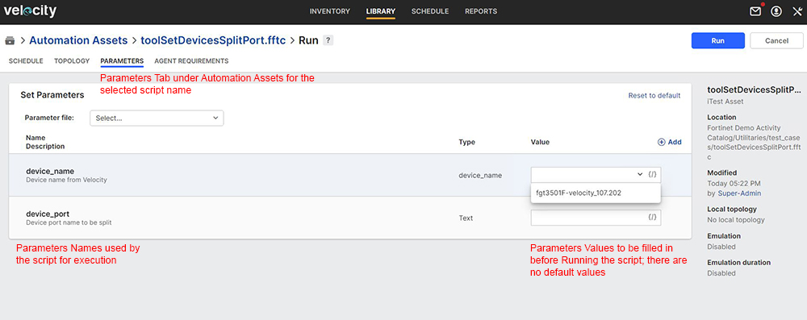

# User Steps:

* **Create a new Topology with a Fortigate resource connected to L2 switch and use Port Speed and Port Split options when building the link**
    * When connecting the Fortigate to a L2 switch for Management just select "New VLAN" from the right side panel within the "Topology" page; Velocity will know how to connect the Fortigate to a L2 management switch based on the existing "Physical Connections" under the Inventory (otherwise you'll get a "Connection" error) 
    * Below in this activity page you can find a sample Topology (\[demo#4\] Topology 1) that can be used for training purposes
    * Click (open in a new window) on "\[demo#5\] Topology 1" below in this activity page and go to the "Topology" page; click "Edit" to open the Topology for editing; click on "VLAN" cloud and check "ID" field in the left side of the page; you can define a custom VLAN ID or you can let Velocity choose a VLAN ID which is not used; Velocity is selecting the VLAN ID value from the "VLAN ID Set" which is defined for all Management L2 switch resources independently (current set is \[1200-1209\] for all Management switches). Change VLAN ID value and save Topology
    * From this activity page click on "Reserve" to start the Reservation; click on "Reservation of \[demo#4\] Topology 1" and go to the "Reservation" page
    * The Management switch "Driver" script is triggered to build the VLAN expected configuration and resolve the Reservation
    * For a single VLAN, Velocity is using tagging "untagged" to identify the request; this translates in sending specific commands through the console connection to create a trunk native VLAN (Fortinet Management switch) using the VLAN ID from Topology
    * If you change the Management VLAN you may want to assign a new management ipAddress to the Fortigate firewall resource; for this purpose there is a mandatory startup task which will assign a new ipAddress for the Fortigate based on range of ip addresses predefined for the Management networks (current: 1200 - 1209)
    * Startup task "optionSetMgmtIpAddr.fftc" will be executed ONLY IF property "Dynamic ipAddress" of the Fortigate is set to "yes" (by default "Dynamic ipAddress" resource property is set to "no"); Only Fortigate devices have this property and you'll need to "Edit" the Fortigate resource before you create the Topology (please see snapshot below under Images section)
    * Velocity will choose the first available host ip address (not used in Velocity for other Resource) based on the Management VLAN ID configured in the Topology
    * Teardown task "optionRestoreDefaultMgmtIpAddr.fftc" will bring back the default Management ipAddress of the Fortigate based on the resource unique Name property
    * Auto "Discover" action should update the ipAddress property of the Fortigate and should be visible automatically in the Topology page (please see snapshot below under Images section) 
    * The default management VLAN ID is "1020" and will be configured by the Driver on the Management switch when Reservation ends and VLAN configuration gets removed
* **Reserve Topology**  
    * Default Reservation duration is set to 30 minutes
    * If Reservation is successful you should see "Release" button to end Reservation; goto "Reservation" page
* **On Reservation Page:**
    * On "Information" tab you should see the Reservation status as Active
    * Goto "Resources" tab and check what Resources were added after the Topology got resolved; you should see Ports information from the Management switch and VLAN information per Port
    * Goto "Automation" tab to see the configured mandatory automated tasks
* **Mandatory Automation Tasks:**
    * Goto "Topologies" section below this activity page and open Startup and Teardown tasks; these are mandatory tasks created by the Admin and configured to execute at the start and end of each Reservation
    * As soon as you hit "Reserve" on this Topology the mandatory Startup task to "Power On" executes for the Fortigate; Click on "Reservation of \[demo#4\] Topology 1" and in the Reservation page navigate to "Automation" tab; The script "optionAllDevicesPowerOn.fftc" (configured as mandatory Startup task) execution report can be displayed in real time if you click on "View report"
    * Startup task "optionSetMgmtIpAddr.fftc" will be executed ONLY IF property "Dynamic ipAddress" of the Fortigate is set to "yes" (by default "Dynamic ipAddress" resource property is set to "no"); Only Fortigate devices have this property and you'll need to "Edit" the Fortigate resource before you reserve the Topology and the startup task execution starts; Auto-Discover will update the new ipAddress property of the Fortigate
    * The "Backup" script "optionBackupVelocityReservationDetails.fftc" configured as mandatory Teardown task is creating a backup archive which is sent to the "Reservation"'s owner (User) email address; the email displays all "Reservation" detailed information about Topology, Resources, Ports and VLANs taken from Velocity as HTML format and also contains the configuration files from all "Fortigate firewall" and "Management switch" devices from Topology and the Topology file as TBML (The TBML file can be imported manually in Velocity)  
    * Expect new email from "velocity@fortinet.com" and check the new assigned management ipAddress for the Fortigate resource
    * Teardown task "optionRestoreDefaultMgmtIpAddr.fftc" will bring back the default Management ipAddress on the Fortigate based on the resource unique "Name" property; Auto-Discover is triggered again to update the default ipAddress and default VLAN configuration on the Management switch (default management VLAN ID is "1020")
    * All Fortigate devices should be Powered Off if they are not used in an active Reservation; these mandatory automated tasks to Power On/Off apply to "Fortigate Firewall" devices only (test switches which are shared among users will not be Powered Off by these automated tasks) 

# Images:
#
#

