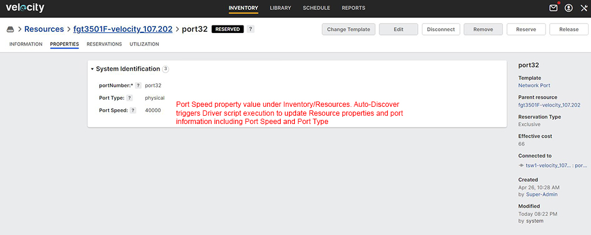
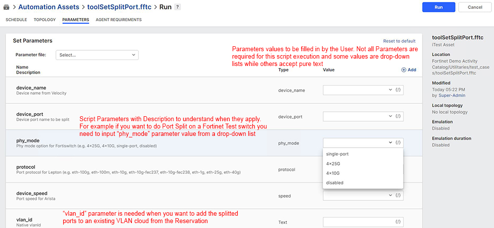
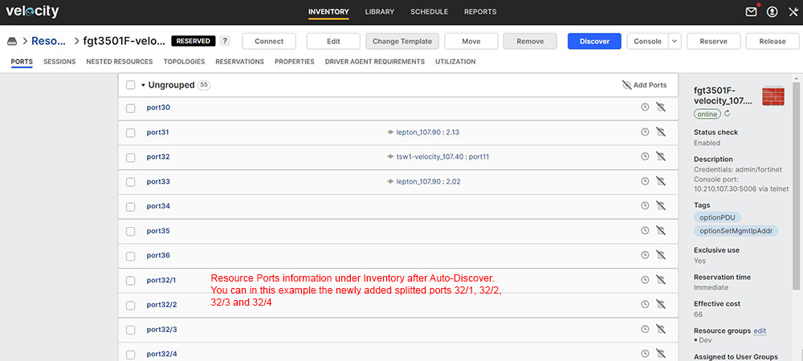

# User Steps:

* **Create a new Topology with a Fortigate resource connected to L2 switch and use automation for Port Speed and Port Split actions**
    * When connecting the Fortigate to a L2 switch just select "New VLAN" from the right side panel within the "Topology" page; Velocity will know how to connect the Fortigate to a L2 switch based on the existing "Physical Connections" under the "Inventory" (otherwise you'll get a "Connection" error)
    * Below in this activity page you can find Topology "\[demo#5\] Topology 1" which can be used for testing purposes; for "Port Speed" and "Port Split" dynamic actions you will use both Startup and Teardown Tasks and Automaton Scripts (please see snapshot under Images section below)
    * Open Topology link in a new tab and click "Edit"; click on "VLAN" cloud and check "ID" field in the left side of the page; you can define a custom VLAN ID or you can let Velocity choose a VLAN ID for you
    * "Save" Topology after editing

* **Reserve Topology**  
    * Default Reservation duration is set to 60 minutes
    * In this activity page click on "Reserve" topology to create a new Reservation; you should see "Release" button to end the Reservation

* **On Reservation Page:**
    * Open Reservation link in a new tab and wait for Reservation to become "Active"; on "Information" tab you should see the Reservation status as "Active" if Reservation is successful 
    * Goto "Resources" tab and check what Resources were added after the Topology got resolved; you should see Ports and VLAN information per Port 
    * Goto "Automation" tab and check madatory tasks execution reports
    * Goto "Topology" tab and check Driver execution for VLAN configuration; you can select the Fortigate resource and open the Console; Quickcalls are available for custom actions with input arguments for "Port Speed" and "Port Split" (e.g. getPortSpeed, setSpeedPort, setSplitPort, unsetSplitPort) 

* **Mandatory Automation Tasks:**
    * Goto "Topologies" section below this activity page and open Startup and Teardown tasks; these are mandatory tasks created by the Admin and configured to be executed at the start and end of each Reservation; execution reports are displayed in real time if you click on "View report" link
    * Startup mandatory task "optionAllDevicesPowerOn.fftc - will "Power On" all Fortigate firewall devices as soon as you hit "Reserve" on the Topology
    * Teardown mandatory task "optionBackupVelocityReservationDetails.fftc" - is used to build a backup archive which is sent to the "Reservation"'s owner (User) email address; the email displays "Reservation" detailed information about Topology, Resources, Ports and VLANs information taken from Velocity as HTML format; it also contains the configuration files from the Devices involved in the Topology and the Topology file as TBML (the TBML file can be imported manually in Velocity)
    * Teardown mandatory task "optionUnsetDevicesSplitPort.fftc" - will perform Unset "Port Split" operation for all Resources Ports involved in the Reservation; this script is configured as mandatory automation Teardown task to assure a clean start with no splitted ports (Ports left splitted may have an impact on Driver execution to retrive ports information and also on "Physical Connections" where all connections are defined statically); Please make sure to use this Teardown task to cleanup all splitted Ports and update Resources ports information in Velocity; Auto-Discover is automatically triggered to update Resources ports infomation
    * Teardown mandatory task "optionAllDevicesPowerOff.fftc" - will "Power Off" all Fortigate firewall devices from Topology; if not used in an Active Reservation all Fortigate devices should be powered off

* **Automation Scripts:**
    * Open the drop-down menu from "Topologies/Automation" section below in this activity page and check existing options; there is a total of 2 scripts available for both topologies - you may notice that all of their names start with "tool(something).fftc" - this notation is used to identify them as scripts which require the User to input parameters values for execution; in contrast all mandatory automation tasks names start with "option(something).fftc" - indicating that there is no need for the User to input any parameter value
    * For "Port Speed" actions you should try automated script "toolSetPortSpeed.fftc" and click on "Run with Options"; the Automation Assets page opens with the script details; go to "Parameters" tab and input values for required Parameters ("device_name", "device_port", "port_speed"); then click Run and you'll get back to the activity page and can view the script execution report in real time (please see snapshot under Images section below)
    * "Port Speed" script execution triggers an "Auto-Discover" so that Ports information gets updated in Velocity; you can go and check Resource Port Speed property from Inventory (please see snapshot under Images section below) 
    * For "Port Split" actions you may want to try first automated script "toolSetSplitPort.fftc" and click on "Run with Options";  the Automation Assets page opens with the script details; go to "Parameters" tab and input values for Parameters ("device_name", "device_port", "phy_mode", "protocol", "device_speed" and "vlan_id"); then click Run and you'll get back to the activity page and can view the script execution report in real time (please see snapshot under Images section below)
    * "Port Split" script execution triggers an "Auto-Discover" so that Ports information gets updated in Velocity; you can go and check Resource Ports information from Inventory (please see snapshot under Images section below)
    * Script "toolUnsetSplitPort.fftc" allows you to unset Port Split operation from the "Active" Reservation; script execution requires Parameters ("device_name" and "device_port") as user input values; all Ports will perform unset Port Split operation when you Stop your Reservation and mandatory Teardown task "optionUnsetdevicesSplitPort.fftc" gets automatically triggered
    * Script "toolSetDevicesSplitPort.fftc" requires Parameters ("device_name" and "device_port") input values and will perform the Split operation across the Link; please use "\[demo#5\] Topology 2" below in this page for training activities; the script accepts as input the "device_port" parameter value and does the Port Split operation also on the other end even if L1 is involved in between; use this script if you want the "Links" from Topology to be splitted; the automated script accepts multiple "device_port" user input values to perform the Port Split operation on multiple Links from Topology

# Images:

