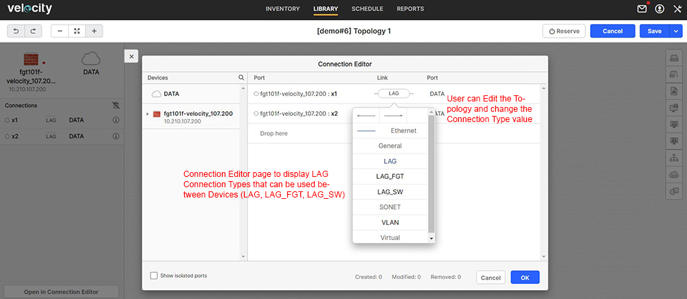
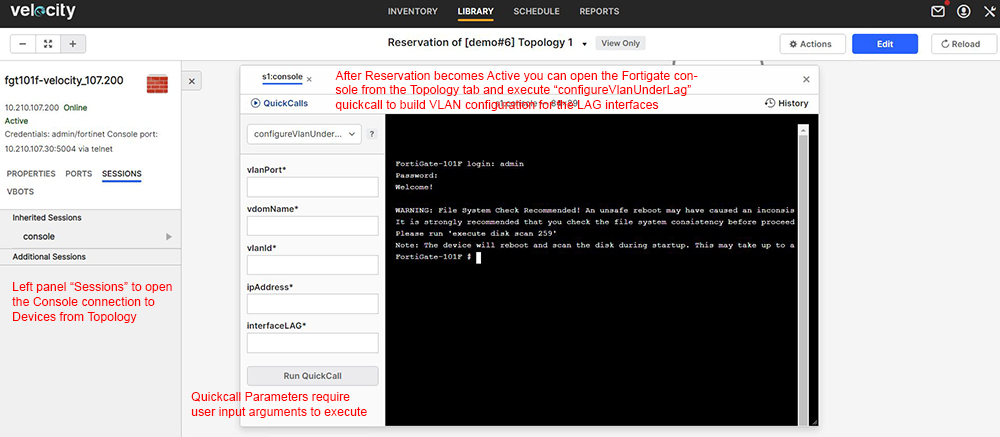

# User Steps:

* **Create a new Topology with a Fortigate resource connected to L2 switch and use LAG feature automation for port connectivity**
    * When connecting the Fortigate to a L2 switch just select "New VLAN" from the right side panel within the "Topology" page; Velocity will know how to connect the Fortigate to a L2 switch based on the existing "Physical Connections" under the "Inventory" (otherwise you'll get a "Connection" error)
    * For LAG feature dynamic implementation you'll need to define a LAG connection type; there are 3 different LAG connection types available: "LAG" - to build LAG ports on the Link (at both ends), "LAG_FGT" - to build LAG ports only on Fortigate end and "LAG_SW" - to build LAG ports only on L2 Test switch side
    * For LAG feature training there are 2 Topologies available below in this activity page; "\[demo#6\] Topology 1"  - for "LAG" connection type and "\[demo#6\] Topology 2" - for "LAG_FGT" and "LAG_SW" connection types
    * Open Topology link in a new tab and click "Edit"; click on "VLAN" cloud and check "ID" field in the left side of the page; you can define a custom VLAN ID or you can let Velocity choose a VLAN ID for you; select the connection between Fortigate firewall and the L2 switch and check connection type field (please see snapshot under Images section below) 
    * "Save" Topology after editing

* **Reserve Topology**  
    * Default Reservation duration is set to 60 minutes
    * In this activity page click on "Reserve" topology to create a new Reservation; you should see "Release" button to end the Reservation

* **On Reservation Page:**
    * Open Reservation link in a new tab and wait for Reservation to become "Active"; on "Information" tab you should see the Reservation status as "Active" if Reservation is successful 
    * Goto "Topology" tab and check Driver execution for VLAN configuration; you can select the Fortigate resource and open Console to build VLAN under LAG; Quickcalls are available for custom actions with input arguments (e.g. getLagDetails, configureLag, configureVdom, configureVlanUnderLag, assignInterfacesToVdom, deleteLag, disableVdom, enableVdom) 
    * Goto "Resources" tab and check what Resources were added after the Topology got resolved; you should see Ports and VLAN information per Port 
    * Goto "Automation" tab and check madatory tasks execution reports  

* **Mandatory Automation Tasks:**
    * Goto "Topologies" section below this activity page and open Startup and Teardown tasks; these are mandatory tasks created by the Admin and configured to be executed at the start and end of each Reservation; execution reports are displayed in real time if you click on "View report" link
    * Startup mandatory task "optionAllDevicesPowerOn.fftc - will "Power On" all Fortigate firewall devices as soon as you hit "Reserve" on the Topology
    * Startup mandatory task "optionSetLagPorts.fftc" - will build LAG ports configuration based on the connection type value from Topology ("LAG", "LAG_FGT" or "LAG_SW"); The User doesn't have to input any parameter for LAG configuration; Vdom configuration is automatically created; Auto-Discover is automatically triggered to update Resources ports information; the LAG port is automatically added to the existing VLAN ID from Topology (please see snapshot under Images section below)
    * Teardown mandatory task "optionBackupVelocityReservationDetails.fftc" - is used to build a backup archive which is sent to the "Reservation"'s owner (User) email address; the email displays "Reservation" detailed information about Topology, Resources, Ports and VLANs information taken from Velocity as HTML format; it also contains the configuration files from the Devices involved in the Topology and the Topology file as TBML (the TBML file can be imported manually in Velocity)  
    * Teardown mandatory task "optionUnsetLagPorts.fftc" - will destroy LAG configuration from Topology devices and will restore previous port configuration; Auto-Discover is automatically triggered to update Resources ports infomation
    * Teardown mandatory task "optionAllDevicesPowerOff.fftc" - will "Power Off" all Fortigate firewall devices from Topology; if not used in an Active Reservation all Fortigate devices should be powered off

    * **Automation Scripts:**
    * Open the drop-down menu from "Topologies/Automation" section below in this activity page and check existing options; there is a total of 2 scripts available for both topologies - you may notice that all of their names start with "tool(something).fftc" - this notation is used to identify them as scripts which require the User to input parameters values for execution; in contrast all mandatory automation tasks names start with "option(something).fftc" - indicating that there is no need for the User to input any parameter value
    * While the Reservation is Active the User has the availability to create/dstroy LAG ports configuration on demand; the "tool" scripts apply to a sigle Device and require specific Parameters for execution
    * To build LAG ports on-demand you can try automated script "toolSetLagPorts.fftc" and click on "Run with Options"; the "Automation Assets" page opens with the script details; go to "Parameters" tab and input values for Parameters ("device_name", "device_port", "sw_mode", "untagged_vlan_id", "tagged_vlan_id" and "po_number"); then click Run and you'll get back to the activity page and can view the script execution report in real time; LAG ports are not added automatically to any VLAN 
    * To unset LAG ports on-demand you can try automated script "toolUnsetLagPorts.fftc" and click on "Run with Options"; the Automation Assets page opens with the script details; go to "Parameters" tab and input values for Parameters ("device_name", "device_port", and "po_number") to remove LAG configuration; then click Run and you'll get back to the activity page and can view the script execution report in real time 

# Images:

